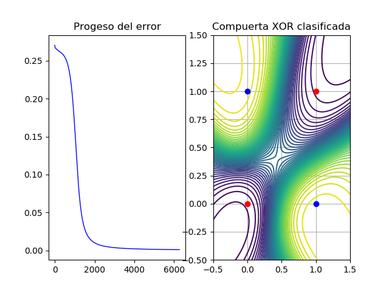

# XOR Clasificacion

Proyecto donde se busca clasificar la compuerta XOR con una red neuronal si uso de librerías externas

Aqui adjunto algunas capturas de la respuesta de la red neuronal

 
<center 

 

La red neuronal que se utilizo fue un perceptron multicapa. El codigo esta hecho para añadir las capas que se necesiten sin alterar nada del codigo base

